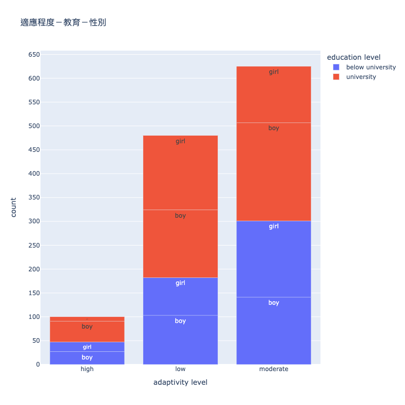

# HW2 多維視覺化
## 作業要求
> 沿用HW1資料，做出視覺化圖表，再提出三個新問題。
> 
> 因為無法顯示圖表，nbviewer也跑不出來，所以改用readme
### [程式碼](https://github.com/Lindergithub/LAT/blob/main/HW2/0621.ipynb)
```python
import pandas as pd
oedf = pd.read_csv('OE.csv')
import matplotlib.pyplot as plt
oedf.columns = oedf.columns.str.lower()
oedf = oedf.applymap(lambda x: x.lower() if type(x) == str else x)
oedf = oedf.rename(columns={"it student": "IT student"})
oedf = oedf.rename(columns={"location": "live in town"})
oedf['education level'] = oedf['education level'].replace('college', 'university')
oedf['education level'] = oedf['education level'].replace(['school'],['below university']) 
oedf=oedf.drop(columns=['device', 'self lms','load-shedding'])
df = oedf.groupby(['gender','education level','adaptivity level']).size().reset_index()
df = df.rename(columns={0: "count"})
import plotly.express as px
#bar
fig = px.bar(df, x="adaptivity level", y="count", color="education level", title="適應程度－教育－性別",width=800, height=800,text='gender')
fig.update_traces(textposition='inside')
fig.update_layout(yaxis=dict(tickmode = 'linear',tick0 = 0,dtick = 50))
fig.update_layout(xaxis=dict(tickmode = 'linear',tick0 = 0,dtick = 1))
fig.show()
```

