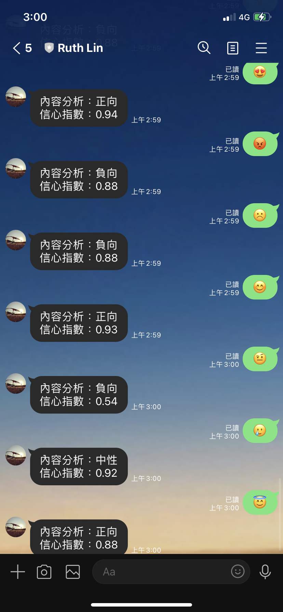
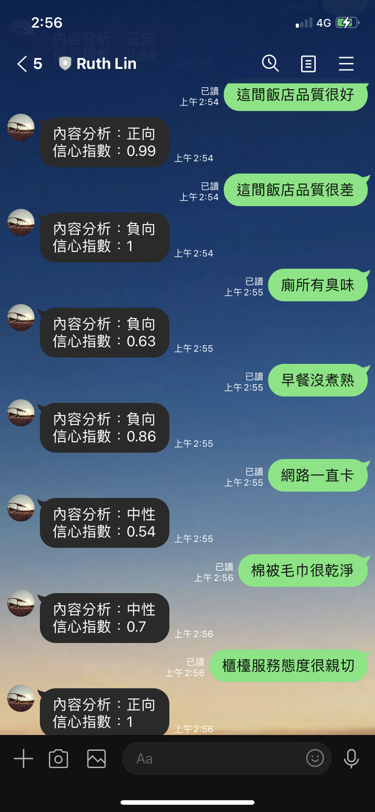

# HW4 情緒分析機器人
## 作業要求
> - [x] Level 1: 直接辨識訊息內容(positive/negetive/netural)
> - [x] Level 2: 改成中文(正向/負向/中性)，並顯示信心指數
> - [ ] Level 3: 針對評論主詞套入回覆訊息

## 作業呈現
> [1] [聊天機器人對話截圖](https://github.com/Lindergithub/LAT/edit/main/HW4/README.md#%E8%81%8A%E5%A4%A9%E6%A9%9F%E5%99%A8%E4%BA%BA%E5%B0%8D%E8%A9%B1%E6%88%AA%E5%9C%96)
>
> [2] [程式碼](https://github.com/Lindergithub/LAT/blob/main/HW4/README.md#%E7%A8%8B%E5%BC%8F%E7%A2%BC)
### 聊天機器人對話截圖
 

### 程式碼
```js
//基本設定
'use strict';
const line = require('@line/bot-sdk'),
      express = require('express'),
      configGet = require('config');
const {TextAnalyticsClient, AzureKeyCredential} = require("@azure/ai-text-analytics");

//Line 組態配置
const configLine = {
  channelAccessToken:configGet.get("CHANNEL_ACCESS_TOKEN"),
  channelSecret:configGet.get("CHANNEL_SECRET")
};


const endpoint = configGet.get("ENDPOINT");
const apiKey = configGet.get("TEXT_ANALYTICS_API_KEY");

const client = new line.Client(configLine);
const app = express();
const port = process.env.PORT || process.env.port || 3001; //要是空的代碼

app.listen(port, ()=>{
  console.log(`listening on ${port}`);
});

//Azure 文字情緒分析
async function MS_TextSentimentAnalysis(thisEvent){
  console.log("[MS_TextSentimentAnalysis] in");
  const analyticsClient = new TextAnalyticsClient(endpoint, new AzureKeyCredential(apiKey));
  let documents = [];
  documents.push(thisEvent.message.text);
  //標籤加入中文選項
  const results = await analyticsClient.analyzeSentiment(documents, 'zh-Hant',{
    includeOpinionMining:true
  }); 
  
  console.log("[results] ", JSON.stringify(results));
  //改標籤為「中文」
  //輸出換行方式："在文字裡面直接加上\n"
  //給定信心指數
  let echoText = '';
  if (results[0].sentiment == 'positive'){
    echoText = '內容分析：正向\n' + '信心指數：' + results[0].confidenceScores.positive;
  }
  else if(results[0].sentiment == 'neutral'){
    echoText = '內容分析：中性\n' + '信心指數：' + results[0].confidenceScores.neutral;
  }
  else{
    echoText = '內容分析：負向\n' + '信心指數：' + results[0].confidenceScores.negative;
  }

  const echo = {
    type:'text',
    text:echoText
  };
     return client.replyMessage(thisEvent.replyToken, echo);
}

app.post('/callback', line.middleware(configLine),(req, res)=>{
  Promise
    .all(req.body.events.map(handleEvent))
    .then((result)=>res.json(result))
    .catch((err)=>{
      console.error(err);
      res.status(500).end();
    });
});
//設定讀取資料邏輯
function handleEvent(event){
  if(event.type !== 'message' || event.message.type !== 'text'){
    return Promise.resolve(null);
  }
//讀進來後，丟到Azure 文字情緒分析
  MS_TextSentimentAnalysis(event)
  .catch((err)=>{
    console.error("Error:",err);    //有錯再顯示
  });  
}
