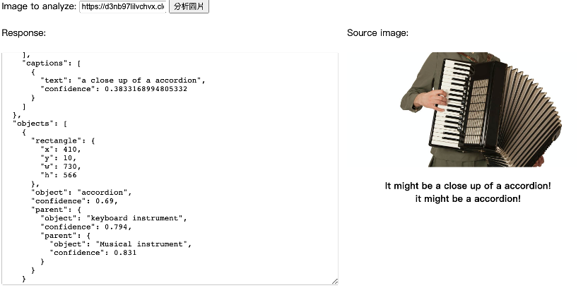
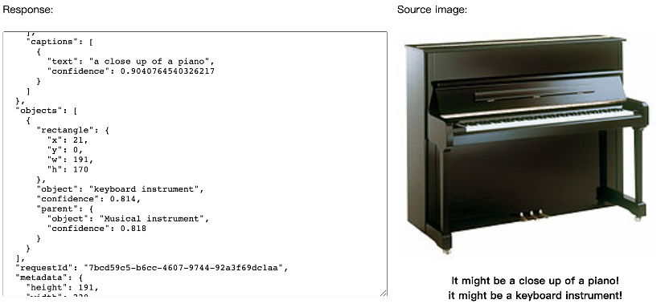
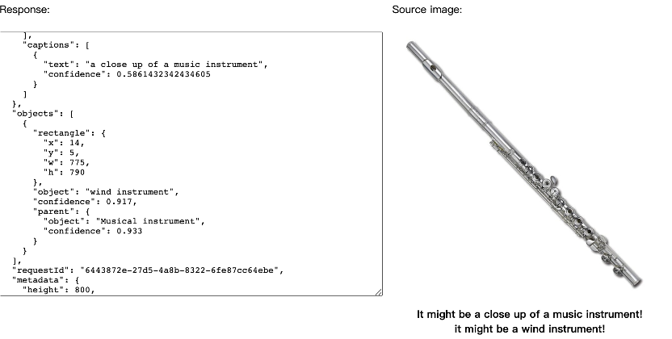
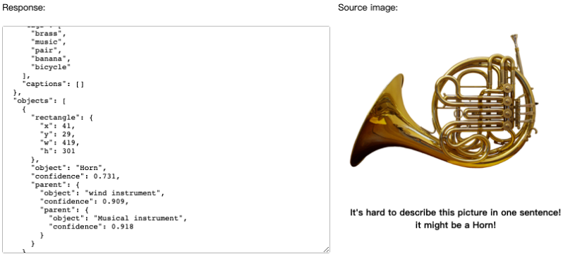
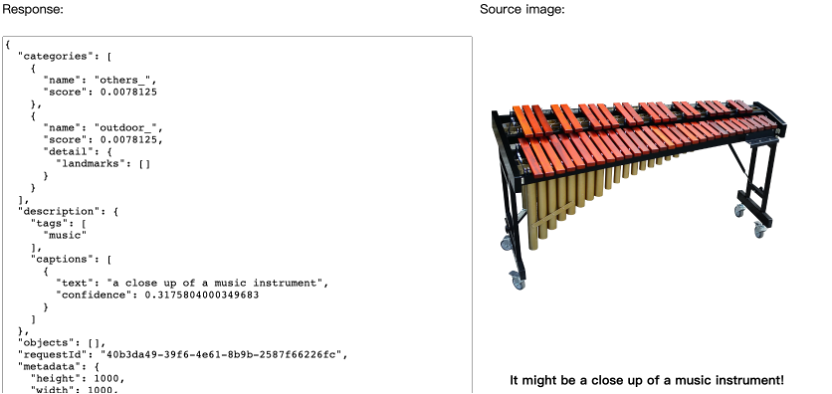
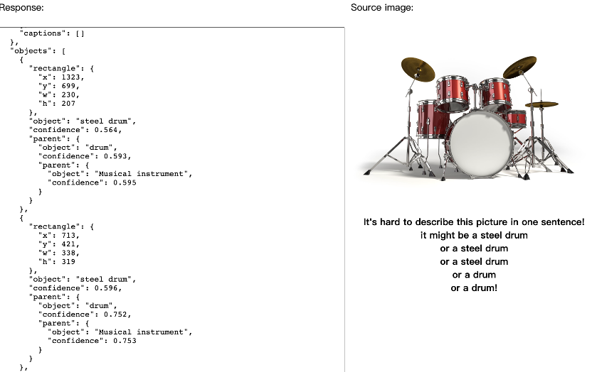
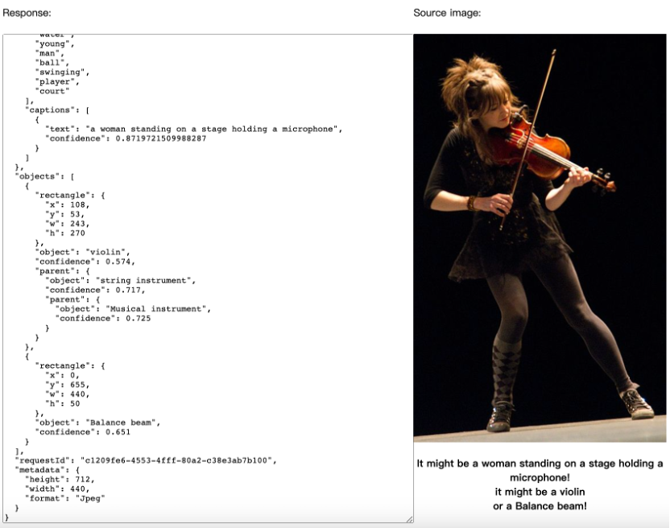
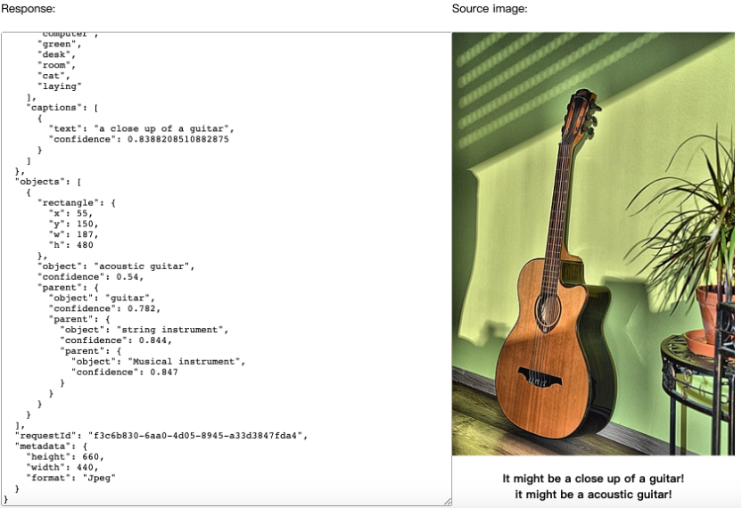

# HW５ 電腦視覺
## 功能說明
> 目的：幫助學生更加了解樂器

## 作業呈現
> [1] [測資、截圖](https://docs.google.com/document/d/1c-BcVhjRTDBrjp-di0-uL9Flp13PtClvNpGTNkA8P_k/edit?usp=sharing)
>
> [2] [程式碼說明](https://github.com/Lindergithub/LAT/blob/main/HW5/README.md#%E7%A8%8B%E5%BC%8F%E7%A2%BC%E8%AA%AA%E6%98%8E)
>
> [3] [main.js](https://github.com/Lindergithub/LAT/blob/main/HW5/main%E6%8B%B7%E8%B2%9D.js)
## 截圖
### 鍵盤
 
 

### 吹奏

 

### 打擊
 
 

### 弦樂
 
 

## 程式碼說明
### 基本參數設定
#### 起始於按鈕：thisButton
```js
$(document).ready(function(){
    //do something
    $("#thisButton").click(function(){
        processImage();
    });
});
```
#### 執行function內容並確認區域與所選擇的相同或使用客製化端點網址
```js
function processImage() {
    var url = "https://eastus.api.cognitive.microsoft.com/";
    var uriBase = url + "vision/v2.1/analyze";
```
#### 客製化服務參數設定
```js    
    var params = {
        "visualFeatures": "Description,Objects",
        "details": "Landmarks",
        "language": "en",
    };
```
### 使用者介面，輸入並分析
#### 顯示分析的圖片
```js
    var sourceImageUrl = document.getElementById("inputImage").value;
    document.querySelector("#sourceImage").src = sourceImageUrl;
```
#### 送出分析
```js
    $.ajax({
        url: uriBase + "?" + $.param(params),
        // Request header
        beforeSend: function(xhrObj){
            xhrObj.setRequestHeader("Content-Type","application/json");
            xhrObj.setRequestHeader("Ocp-Apim-Subscription-Key", subscriptionKey);
        },
        type: "POST",
        // Request body
        data: '{"url": ' + '"' + sourceImageUrl + '"}',
    })
    .done(function(data) {
```
### 輸出結果設定
#### 顯示JSON內容
```js
        $("#responseTextArea").val(JSON.stringify(data, null, 2));
```
#### 先清空
```js
        $("#picDescription").empty();
```
#### 先看有沒有一句話描述，有就說「可能是...」，沒有就説「不好説...」
```js
        $("#picDescription").text(data.description.captions && data.description.captions.length > 0
        ? "It might be " + data.description.captions[0].text + "!"
        : "It's hard to describe this picture in one sentence!");
        //註解意思一樣，但註解所跑出來的結果<br>沒有換行效果，所以直接用chatgpt改成上面三行
        // $("#picDescription").text();
        // if (data.description.captions && data.description.captions.length > 0) {
        //     $("#picDescription").text("It might be " + data.description.captions[0].text + "<br>")
        // } else {
        //     $("#picDescription").text("It's hard to describe this picture in one sentence!" + "<br>")
        // };
```
#### 觀察後發現「object」都會出現正確答案，用if判斷objects是否為空，若否則輸出項目0，有多個項目則進入for迴圈
```js 
        if (data.objects && data.objects.length > 0) {
        $("#picDescription").append("<br>" + "it might be a " + data.objects[0].object )    
            for (var x = 1; x < data.objects.length; x++) {
                $("#picDescription").append("<br>" + "or a " + data.objects[x].object);
            }
        $("#picDescription").append("!")    
        }
    })
```
#### 有問題丟出錯誤訊息
```js
    .fail(function(jqXHR, textStatus, errorThrown) {
        var errorString = (errorThrown === "") ? "Error. " : errorThrown + " (" + jqXHR.status + "): ";
        errorString += (jqXHR.responseText === "") ? "" : jQuery.parseJSON(jqXHR.responseText).message;
        alert(errorString);
    });
};
```
