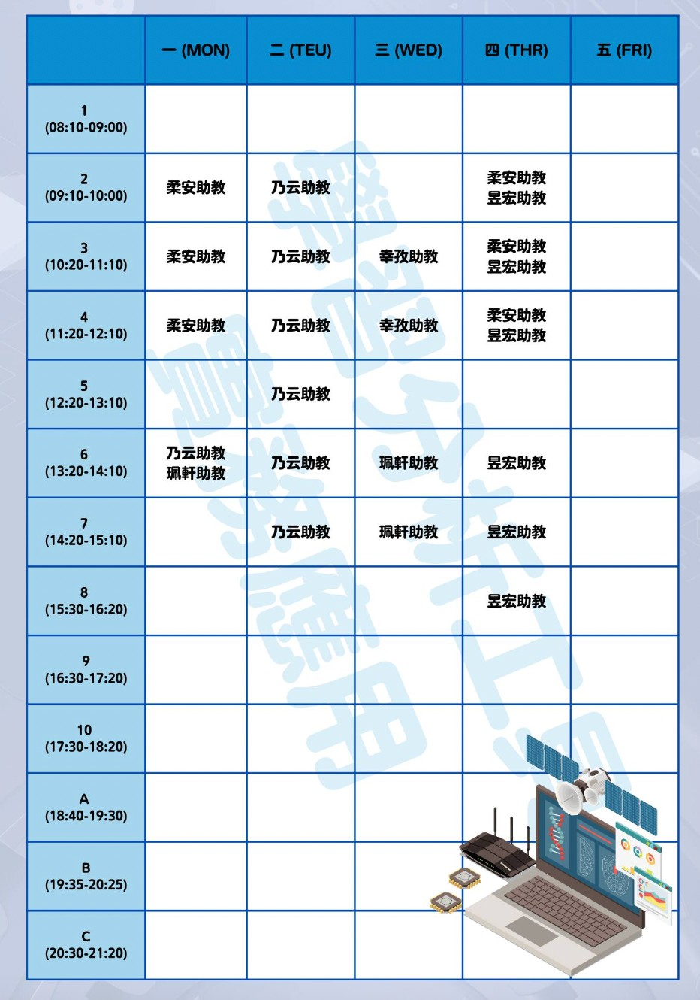

# 111-2臺師大教育大數據微學程

## 課程資訊
> + 課程名稱：學習分析工具實務運用
> + 授課教師：蔡芸琤
> + 姓名：林鈺茹
> + 系級：科技系114年級
## 目錄
> + [課程筆記區](https://github.com/Lindergithub/LAT/edit/main/README.md#%E8%AA%B2%E7%A8%8B%E7%AD%86%E8%A8%98%E5%8D%80)
> + [作業連結區](https://github.com/Lindergithub/LAT/edit/main/README.md#%E4%BD%9C%E6%A5%AD%E9%80%A3%E7%B5%90%E5%8D%80)
> + [專題連結區](https://github.com/Lindergithub/LAT/edit/main/README.md#%E5%B0%88%E9%A1%8C%E9%80%A3%E7%B5%90%E5%8D%80)
## 課程筆記區
### [LAT repo](https://docs.google.com/spreadsheets/d/e/2PACX-1vT_zJV6gYfbNv8irou82vBJjx76eTwu8-oBLzV5VlQhuD8eNychjpKbTCAZgGJKv5og303hZdXX_ygo/pubhtml#)
### [Ryan老師的課程筆記](https://hospitable-top-f1b.notion.site/111-2-NTNU-31ed6721887f4b24bd52c6102a8d99c7)
### PPT 
> + [week1](https://docs.google.com/presentation/d/e/2PACX-1vSInSmBw4pmnFj-4BoVDQcXDkXJ23WMGXBWPkHTTm99t0rigaeIYzMpjC8Q7nKu9SZWeNAs6q1Wy5ZE/pub?start=false&loop=false&delayms=3000&slide=id.p)
> [Video](https://www.youtube.com/watch?v=xm7m9u6jUgc)
> + [week2](https://docs.google.com/presentation/d/e/2PACX-1vT-TbdyqnFFYyOREkTHFGj8OMr3z4-77otHUtDB1PZk_hy4H1sO0_ZXdsaTg1qping-CP_2kEhcvlu0/pub?start=false&loop=false&delayms=3000&slide=id.p)
> [Video](https://www.youtube.com/watch?v=HoPOMwI2NhA)
> + [week3](https://docs.google.com/presentation/d/e/2PACX-1vRQ-QbIIGrpvbC7PkYFtWhT8hhT2pREfIYP5OxiYPF125Ag1u4ln-f7EKR_znsU-bM1z-RrxFY3qHba/pub?start=false&loop=false&delayms=3000&slide=id.p)
> [Video. 聲音超怪](https://www.youtube.com/watch?v=0Ug8Pr7miOo)
> + [week4](https://docs.google.com/presentation/d/e/2PACX-1vQTkndQGs2LVuR27vv0lbSpZPKY6j-7pNcF4SvSTZhflcTOi2XxCp8iSFgxiX5KoB61cI9ZPZix8Vn5/pub?start=false&loop=false&delayms=3000&slide=id.p)
> [Video](https://www.youtube.com/watch?v=lv04AXEq0Rk)
> + [week5]chatgpt
> [Video](https://www.youtube.com/watch?v=d7c-pGlJAOI)
> + [week6](https://docs.google.com/presentation/d/e/2PACX-1vSF3Y3YNF7rwKxFz4tKxHwZY1qOdM17iDWN9emYrDkXIHYdIDXxOtS2j5sfq18HPO6w4-ye7ekB9lvN/pub?start=false&loop=false&delayms=3000&slide=id.p)
> [Video](https://www.youtube.com/watch?v=D-k57QOvRlg)
> + week7 放假一次
> + week8 - Intro to Azure AI
> [Video](https://www.youtube.com/watch?v=JYiXyxKLJc0&list=PL6HWDH-x2DrlD4A3T94sORnZEltA3WKdb&index=2)
> + week9
> [Video](https://www.youtube.com/watch?v=5n80gistmxU)
> + week10 - Azure Text Sentiment Analysis
> [Video](https://www.youtube.com/watch?v=HTvl5skHsck&list=PL6HWDH-x2DrlD4A3T94sORnZEltA3WKdb&index=3&t=637s)
> + week11 - Final Project Plan & Azure Text Sentiment w/ Line
> [Video](https://www.youtube.com/watch?v=GLZ9rVEa_54&list=PL6HWDH-x2DrlD4A3T94sORnZEltA3WKdb&index=4)
> + week12 - Hotel Review Bot + JSON Server on Azure + Live Plotly Dashboard
> [Video](https://www.youtube.com/watch?v=llSEt0FbQT4&list=PL6HWDH-x2DrlD4A3T94sORnZEltA3WKdb&index=5)
> + week13 - Azure Computer Vision API
> [Video](https://www.youtube.com/watch?v=oNyrigYdVio&list=PL6HWDH-x2DrlD4A3T94sORnZEltA3WKdb&index=6)
> + [week14]
> [Video]()

### 
## 作業連結區
+ [HW1](https://github.com/Lindergithub/LAT/blob/main/lat_hw1.ipynb)
+ [HW2]
+ [HW3]
+ [HW4]
+ [HW5]
## 專題連結區
+ [ppt]
+ [vedio]
